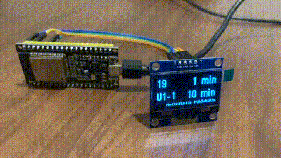

## Description

A custom departure board: a display showing live departures for public transport network (HVV), plus a scrolling banner for active service disruptions.

## Hardware

- ESP32 dev board
- SH1106 1.3" I2C OLED display

## Configuration

configurations and secrets live in gitignored `include/imhr_secrets.h`
